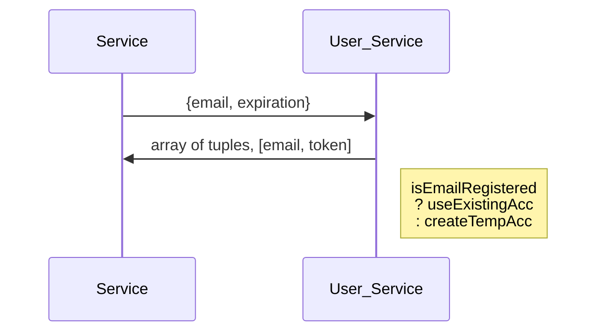

# Authorization Server

#### Description

Self-Explanatory

#### Motivation

Self-Explanatory

#### Thoughts on design

1. Will need to periodically query db to clean out expired tokens.
    - make them TTL docs and let the db handle it?
    - may be nice to say to the user, "Hey this is an expired token and you need to register in order to keep using the website" or something like that

#### Tentative Full DB Models

We'll eventually need some location data.

```json
{
  "_id": ObjectId,
  "meta": {
    "createdAt": date,
    "createdBy": object, // maybe the inviter or the user itself?
    "method": "invitation" | "registration" // may be more methods in the future
  },
  "name": {
    "first": string,
    "last": string
  },
  "roles": string[]
}
```

Temporary Account

```json
{
    "_id": ObjectId,
    "meta": {
        "createdAt": date,
        "createdBy": object, // maybe the inviter or the user itself?
        "method": "invitation" // the only way to make temp accounts right now
    },
    "email": {
        "address": string,
        "verified": "false" // we won't require full reg unless fully register, but the email will already be valid? I guess
    },
    "name": {
        "first": string,
        "last": string
    },
    "roles": ["temp-user"]
}
```

#### Server-Server Publications

1. "user-create"
2. "user-update"
3. "user-delete"

#### Subscriptions

Unknown right now

#### Endpoints

1. POST /create (analagous to register)
    - public
    - need to rate limit this
2. POST /owner/update/:\_id
    - [owner]
    - Can only update certain fields: `password`, `username`, `email.address`,& `name`
3. DELETE /delete/:\_id
    - [owner, admin]
4. POST /ban/:\_id
    - [admin]
5. POST /generate-login-tokens
    - [server-server only]
    - if successful -> 200, tuples
    - if not authorized -> 401


1. POST /password-reset/consume?token={token}
2. POST /password-reset/send
3. POST /login
